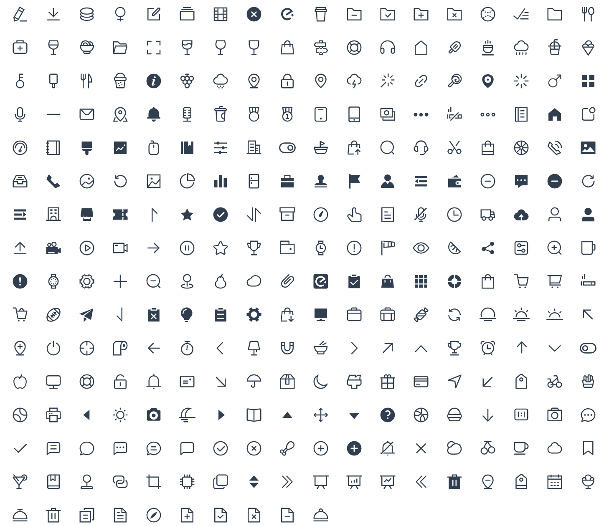

# @mate-ui/icon

> Icon from [element-plus-icons](https://github.com/element-plus/element-plus-icons)

## Usage

```bash
npm i @mate-ui/icon
#or
yarn add @mate-ui/icon
#or
pnpm i @mate-ui/icon
```

## Icons


